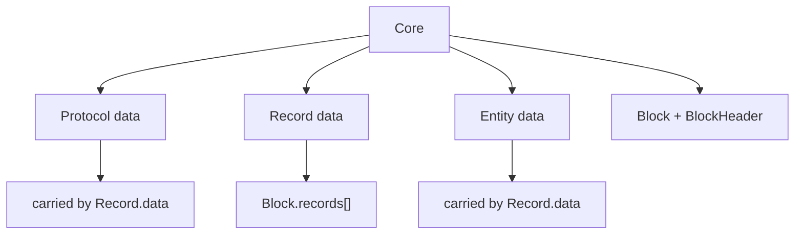
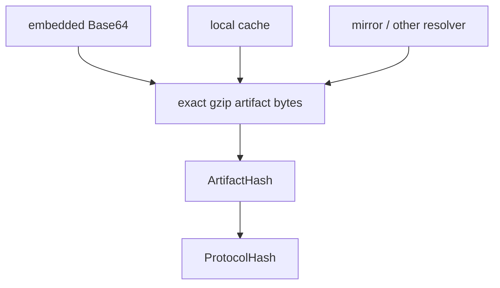
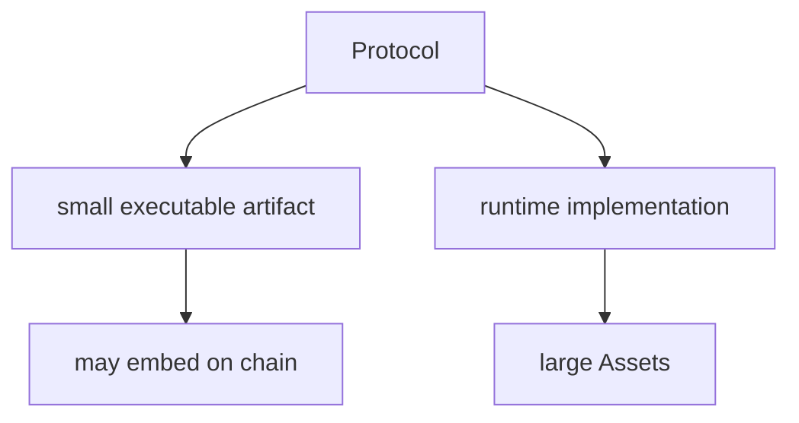

# Current Architecture

本文记录 LabourChain/Core 当前接受的总体边界。历史事实依据见 [`source-baseline.md`](source-baseline.md)。

## Core 的职责

Core 只负责最小区块链确证结构，不负责劳动确证、项目组织、资产业务或 Cordis 插件生态治理。

当前 Core 包含四个 Protocol：

```text
core.protocol
core.record
core.entity
core.block
```



`BlockHeader` 是 `core.block` 的公开类型，不存在独立 `core.block-header` Protocol。

## Protocol 与 Cordis Plugin

LabourChain 使用 **Protocol** 表示会被链上历史长期引用的稳定、版本化语义与 executable identity。**Plugin** 保留给 Cordis 的运行时插件抽象。

因此两者是不同层级：

```text
LabourChain Protocol
-> chain-facing stable semantics / identity

Cordis Plugin
-> runtime composition / lifecycle abstraction
```

未来一个 Protocol implementation 可以由 Cordis Plugin 承载和运行，但 Core 不因此重新定义 Cordis 的 Plugin、Context、Fiber、Service、inject、effect 或 lifecycle。当前 `js-esm` artifact 如何严格对齐 Cordis Plugin contract 另行审查，不在 terminology 恢复中静默决定。

## Core 不承担劳动确证

Core 确认的是一组 Records 以确定的数据格式被放入区块，并形成连续、可验证的链历史。

它不直接判断劳动是否完成、劳动量、成果归属、Project 组织、Asset 演化或 Repository / Member 权限。这些语义由后续 `work.*`、`labour.*`、`repo.*`、`project.*` 等 Protocol 定义，并以普通 Record 进入链；其运行时实现可通过 Cordis Plugin 组合。

因此 Core confirmation chain 与 Labour / Asset / Project 等业务图正交。

## Protocol 是 Record.data

旧 Service 中 `Protocol` 本身就是普通 Record 的 `data`。当前设计保留这一组合关系，同时把旧 schema-only Protocol 演化为可携带 exact executable implementation identity 的 Protocol。

```text
Record
├── protocol = core.protocol@version
├── protocolHash
├── createdBy
├── createdAt
├── signature
└── data = Protocol
```

`core.protocol` 只定义 Protocol data、executable identity 与 exact artifact verification：

```text
validateProtocol
artifactHash
protocolHash
verifyArtifact
verifyEmbeddedArtifact
```

JCS canonical identity construction 保持 internal。构建、bundle、gzip、reproducible build、release preparation 属于 Protocol Dev SDK #23；发行与 discovery 属于 #24。

## 历史 Protocol 的演化

历史 Protocol 的 `schema / package / contributors / description` 不进入当前 executable identity。当前 Protocol 只保留现阶段 identity/runtime verification 所需的最小数据：

```text
name
version
runtime { kind, abi }
dependencies[]
artifactHash
artifact?
```

历史 CUE/schema 继续作为 Source Fact 保存，但不是当前 runtime schema。

恢复 `Protocol` 命名不是恢复旧 schema-only 模型，也不是为 Cordis 建立第二套 Plugin runtime；它恢复的是 LabourChain 链上语义对象本身的名称。

## Artifact identity 与存储分离

ABI v1 每个 Protocol 只有一个 exact gzip executable artifact：

```text
ArtifactHash = DoubleSHA256(exact gzip artifact bytes)
```

ArtifactHash 进入 ProtocolHash。可选 `artifact` 是 exact gzip bytes 的 canonical Base64 链内承载，不进入 ProtocolHash。



因此相同 bytes 无论随 Record 上链、本地 cache、Repo/object storage、HTTP mirror 或未来其他 resolver 取得，都验证为同一个 Protocol identity。

MVP 初始 Core Protocols 应携带 embedded artifact，从而不依赖独立 registry 完成 bootstrap。

## Artifact 与 Asset 分层

Protocol artifact 只包含 Protocol implementation 运行所需的代码与必要小型 runtime data。

大型模型、图片、视频、地图、词典、数据集或游戏资源包属于 Asset / Runtime 层，不应塞入 executable Protocol artifact。



`core.protocol` 不依赖 Asset，也不定义 AssetId。

## Protocol 大小边界

Protocol implementation 是小型可执行协议单元。

```text
compressed artifact > ~500 KiB
-> build / Dev SDK warning only

uncompressed js-esm runtime > 1 MiB
-> ABI v1 hard reject before import
```

1 MiB 同时是资源安全边界与工程边界。超过该规模应优先拆分 Protocol implementation，或把非执行内容移入 Asset / Runtime。

## Record 是通用事实容器

Record common envelope：

```text
id
protocol
protocolHash
createdBy
createdAt
signature
data
```

Record 同时表达协议来源与主体来源：

```text
protocol / protocolHash
-> 哪个链上 Protocol 解释这条 Record

createdBy / signature
-> 哪个 Entity 对这条 Record 负责并确认
```

`protocolHash` 是 runtime/composition 使用的 exact Protocol identity；`protocol = name@version` 是人类可读声明，并作为签名事实参与 RecordId。

```text
RecordId = DoubleSHA256(JCS(RawRecord))
```

RawRecord 包含 `protocol / protocolHash / createdBy / createdAt / data`。`id` 与 `signature` 不参与 RecordId。

当 `Record.data = Protocol` 且携带 embedded artifact 时，embedded artifact 虽不进入 ProtocolHash，却进入该条 Record 的 RecordId；这是 executable identity 与 fact identity 的有意分离。

普通 Record 使用 domain-separated Ed25519 signature over RecordId。`core.record` 不 resolve 或执行 Protocol。

## Entity 是链级身份数据

```text
Entity {
  publicKey
  introducedBy?
}
```

`publicKey` 是稳定 `EntityPublicKey`。`introducedBy` 只记录可选引荐来源，不承担 ownership、membership、多签、权限或永久信任语义。

Member、Repository、Organization 等不是 Entity 子类；它们在领域 Protocol 中引用 `EntityPublicKey`。

`Record.createdBy`、`BlockHeader.packer` 与 `Entity.introducedBy` 使用同一 base58btc Ed25519 public-key representation。

## Block 是 Record 的确证容器

```text
Block
├── header: BlockHeader
└── records: Record[]
```

Block 负责批量承诺 Records、前后区块连续性和 packer confirmation；它不承担 Labour / Asset DAG 的业务拓扑。

ordinary Block 保留 ordered RecordId Merkle commitment，禁止 duplicate RecordId，BlockId 从 unsigned Header 派生，packer 对 BlockId 做 domain-separated Ed25519 confirmation。

Protocol availability、PoA authorization 与业务依赖不属于 standalone Block validity。

## Genesis 继续是 Block

历史 Service 的 Genesis 是实际 Block；当前仍保持：

```text
Genesis Block
└── records[]
    ├── Record<data = Protocol + embedded artifact>
    ├── Record<data = Protocol + embedded artifact>
    └── ...
```

不存在独立于 Record/Block 的第二套 S0 Protocol artifact 通路。

MVP 初始 Core Protocols 携带完整 embedded gzip artifact，使节点只凭 Genesis/链数据即可取得解释链所需 executable content。

Genesis 的 Record/Block bootstrap 特例由 #10 独立审查；`core.protocol` 不定义 Genesis-specific validity。

## Runtime 边界

Runtime/composition 提供：

```text
process / Cordis Context
Protocol resolution by ProtocolHash
artifact cache / external fetch
bounded gunzip / module loading
Cordis Plugin mounting / lifecycle
Asset fetch / storage
filesystem / object storage
network transport / sync
secret-key storage / signer
sandbox / capability policy
observability
```

Core Protocol 对相同显式输入必须给出确定性结果；Runtime 不改变 Core 数据模型。

普通 npm/pnpm/build dependency 在 Protocol build 阶段处理。`core.protocol` identity 只记录最终 artifact 与当前定义的 exact chain Protocol dependencies。`dependencies[]` 与 Cordis `inject` 的最终边界将在后续 runtime alignment 中单独审查，本轮只恢复命名。

## Repo / Labour / Board / Flow 边界

Repo 管理 Repository、Member、Asset、源码/build provenance 等业务事实和资产，不反向成为 Core Protocol 的隐藏依赖。

劳动事实、劳动确认、劳动成果与价值关系由后续 `labour.*` / `work.*` Protocol 定义。Core 只保存并确认相应 Records；这些 Protocol 的运行时 implementation 应复用系统选择的 Cordis composition，而不是再建立一套 Plugin runtime。
