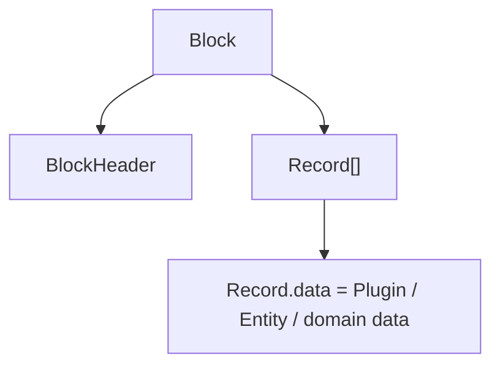

# Block Plugin

本文记录 `core.block` 当前已经确认的结构边界与历史迁移基线。具体 BlockHeader 字段、Header 签名、BlockId、Genesis linkage 和 Plugin Record availability 需要在 `core.block` 专门审查中依据旧 Service 重新冻结。

历史事实见 [`source-baseline.md`](source-baseline.md)。

## Source Fact

旧 `blockchain-service` 的基础容器是：

```text
Block
├── Header: BlockHeader
└── Records: Record[]
```

历史 `BlockHeader`：

```text
hash
previousHash
createdAt
packer
signature
```

历史 Genesis 也是一个 `Block`，系统 Protocol、Root Member、Genesis Repository 等都先构造成 Records，再进入 `Block.records[]`。

旧 Service 还实现了 ordered RecordId Merkle 计算：

```text
0 ids -> ""
1 id  -> id
pair  -> DoubleSHA256(left + right)
odd   -> duplicate last id, then hash
repeat until one value remains
```

这些是后续 `core.block` 审查的 Source Facts。

## Current confirmed boundary

当前只冻结以下结构原则：



`BlockHeader` 是 `core.block` 的公开类型，不再作为独立 `core.block-header` Plugin。

Block 负责区块链层面的批量确证/存储容器，不承担 Labour / Asset / Project 的业务因果拓扑。

## Confirmation order 与业务关系

Block Chain 表达链确证顺序：

```text
Genesis -> Block -> Block -> ...
```

它不自动表达：

```text
劳动发生顺序
Asset lineage
Project dependency
Repository membership
source/build causal graph
```

这些关系由对应领域 Plugin 在 `Record.data` 中定义。

Record 数组顺序属于 Block representation；它是否以及如何进入当前版本 Merkle/Block identity，要在 `core.block` review 中依据历史算法和当前需求确认。

## Plugin availability — pending review

Plugin 现在恢复为普通：

```text
Record.data = Plugin
```

因此此前文档中的：

```text
activePluginState
Plugin release confirmed in N -> active in N+1
freeze pre-Block Plugin state
apply Plugin releases after Block acceptance
nextPluginState
```

均不再是已经冻结的 `core.block` 设计。

专门 review 需要回答：

```text
Block 如何找到解释每条 Record 的 exact Plugin
同 Block 较早的 Plugin Record 能否供后续 Record 使用
Plugin dependency 能否引用同 Block 较早 Plugin Record
是否需要 pre-Block snapshot
Genesis Plugin Records 如何 bootstrap
```

## BlockHeader / identity — pending review

此前提出过新的候选字段：

```text
previousBlock
recordsRoot
createdAt
packer
signature
```

以及候选 `BlockId = DoubleSHA256(canonical signed Header)`。

这些不是本轮 `core.plugin` 修正后自动成立的事实。后续必须对照历史：

```text
hash
previousHash
createdAt
packer
signature
```

及旧 `VerifyBlockHeader` / Genesis Header signing 行为逐项审查。

同样，此前独立 `GenesisId` / `S0` package linkage 已撤销，不能再作为 `core.block` 的既定前提。

## Packer 与 Runtime 边界

可以继续保留的原则是：

```text
Block 数据中的 packer/signature
!= packer authorization policy
```

secret-key storage、节点运行、canonical-chain selection、network sync、persistence 等属于 Runtime/network composition，不属于 Block 数据类型本身。

具体 packer key 编码和签名 payload 仍需随 `core.entity` / `core.block` review 一并确认。

## Review gate

在 issue #9 完成 source-aligned review 之前，不应依据本文件实现：

```text
新的 BlockHeader canonical JSON
新的 BlockId
GenesisId linkage
activePluginState
N -> N+1 Plugin activation
same-Block Plugin rejection
nextPluginState
```

当前可安全实现/讨论的只有 source-derived Block/BlockHeader/Merkle facts 与“Block 是 Record 容器、业务 DAG 不属于 Block 通用语义”的边界。
