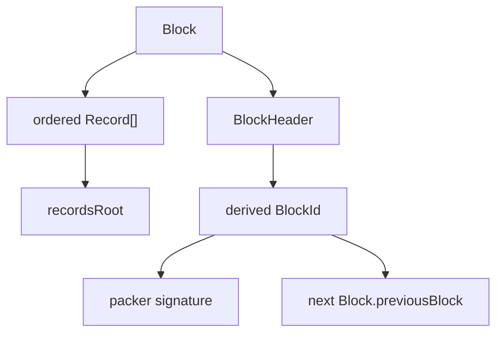

# Block Plugin

本文记录 `core.block` 已完成审查的 ordinary Block 确证合同。Genesis bootstrap Record 特例仍由独立 Genesis review 决定。

历史事实见 [`source-baseline.md`](source-baseline.md)。

## Source Fact

旧 `blockchain-service` 的基础容器是：

```text
Block
├── Header: BlockHeader
└── Records: Record[]
```

历史 `BlockHeader`：

```text
hash
previousHash
createdAt
packer
signature
```

历史 `hash` 实际写入 ordered RecordId Merkle root，而不是整个 Block 的 identity。旧 runtime `VerifyBlockHeader` 只验证 Header signature，没有重算 Merkle、验证 Records、检查 previous linkage 或建立独立 BlockId；Genesis signing bytes 又与 runtime verifier 不一致。

因此当前迁移保留数据组合和 Merkle 基础，但不把旧 Header 命名与不完整 verifier 原样复制。

## Current Block



当前 ordinary Header：

```text
recordsRoot
previousBlock
createdAt
packer
signature
```

`BlockHeader` 是 `core.block` 的公开类型，不存在独立 `core.block-header` Plugin。

## Records root

保留历史 ordered RecordId Merkle：

```text
0 ids -> ""
1 id  -> id
pair  -> DoubleSHA256(left + right)
odd   -> DoubleSHA256(id + id)
repeat until one value remains
```

`left/right` 是 64 位小写十六进制 RecordId 的 UTF-8 文本，内部节点同样输出小写十六进制 DoubleSHA256。

Record 数组顺序进入 Block commitment。空 Block 仍然允许。

历史 odd-leaf duplication 会产生一个确定性的歧义：

```text
recordsRoot([A, B, C])
== recordsRoot([A, B, C, C])
```

因为两者第一层都包含 `DoubleSHA256(A+B)` 与 `DoubleSHA256(C+C)`。这不是哈希碰撞，而是树构造本身的性质。

为了继续保留历史 Merkle 算法，又不新增 leaf domain 或 `recordCount` Header 字段，当前 Core 直接禁止同一 Block 中出现重复 RecordId。`recordsRoot(recordIds)` 与 `verifyBlock(block)` 都必须拒绝 duplicate RecordId。

这个约束只用于确保 confirmation container 能唯一承诺 ordered RecordId sequence，不代表 Block 在验证业务 DAG。

Block commitment 只承诺 RecordId，不承诺 Record signature bytes；每条 Record 的 author signature 仍由 `verifyBlock` 独立验证。

## Block identity

旧 `hash` 正名为 `recordsRoot` 后，Block identity 单独从 unsigned Header 派生：

```text
BlockId = DoubleSHA256(JCS({
  recordsRoot,
  previousBlock,
  createdAt,
  packer
}))
```

`BlockId` 不额外写入 Header，也不包含 `signature`。`blockId()` 可以接收 unsigned Header 或完整 Header；完整 Header 的 `signature` 被明确排除在 identity 外。

普通链链接：

```text
current.previousBlock = blockId(previous)
```

`previousBlock` 表示允许 64 位小写十六进制 BlockId，并保留历史 `"0"` 作为 first-link sentinel 的表示位；Genesis 是否继续实际使用 `"0"` 由 Genesis review 最终确认。

## Packer confirmation

`packer` 使用 `core.entity` 已冻结的 raw 32-byte Ed25519 public key 的 base58btc 表示。

Block signature 使用 128 位小写十六进制，签名 payload：

```text
UTF8("labourchain:block:v1:") || hexDecode(BlockId)
```

因此旧 CUE Base64-like、runtime hex packer 编码和 Genesis/runtime 两套 JSON signing bytes 都不继续继承。

PoA packer authorization 与 Entity 注册/准入都属于外部 Repo/network/runtime policy；`core.block` 只验证声明的 packer 使用对应私钥对该 BlockId 签名。

## Confirmation order 与业务关系

Block Chain 表达 confirmation/storage order：

```text
Genesis -> Block -> Block -> ...
```

同一个 Block 内的 Records 可以存在真实领域依赖，例如一个劳动 Record 使用另一个劳动 Record 的产出。Core 不从 Record 数组位置推导或验证 Labour / Asset / Project 的业务拓扑。

领域 tracing、输入输出一致性与因果规则由相应 Plugin 负责。

## Plugin availability

正常 composition 应让 Plugin 在依赖它产生 Record 之前已经可取得、验证和运行，因此不推荐 Plugin 的首次发布 Record 与依赖它的普通 Record 首次出现在同一个 Block。

这不是 Block validity rule。`core.block` 不维护：

```text
activePluginState / nextPluginState
N -> N+1 activation
pre-Block Plugin snapshot
same-Block Plugin activation/inactivity
Plugin Record 必须排在使用者之前
Plugin dependency 按 Block 顺序解析
```

runtime/composition 根据 `pluginHash` 获取 exact Plugin。

## `verifyBlock` boundary

ordinary `verifyBlock` 只验证确定性的确认容器：

```text
Block / Header representation
-> ordinary Record envelope + RecordId
-> ordinary Record author signatures
-> RecordId uniqueness
-> ordered recordsRoot
-> Header BlockId
-> packer signature
```

它不验证 Plugin 执行、业务 DAG、Entity 注册状态、PoA 授权、canonical-chain selection、网络同步、存储或 `previousBlock` 是否等于某个本地 chain head；最后一项需要外部链上下文。

## Minimal API

```text
recordsRoot(recordIds)
blockId(rawHeader | header)
blockSigningPayload(blockId)
verifyHeader(header)
verifyBlock(block)
```

另公开 Block 类型与 `BlockError`。

Block 侧使用 `blockSigningPayload`，避免与根导出中已有的 Record `signingPayload` 冲突。

## Genesis boundary

Genesis 继续是一个 Block，初始 Core Plugins 通过 `Record.data = Plugin` 进入 `records[]`。

独立 `GenesisManifest`、`GenesisId`、S0 Plugin artifact set 不再作为前提。

历史 bootstrap RecordId、`createdBy = "Root"`、unsigned Record、Root Member/Repository 与 first-link sentinel 的最终保留范围由 #10 Genesis review 决定，不反向修改 ordinary `core.block` 的 Plugin/business 边界。
