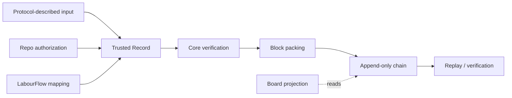

# LabourChain Core Protocols

## Purpose

LabourChain Core is the blockchain foundation of the LabourChain MVP. It owns the deterministic rules that turn protocol-described input into verifiable records, pack accepted records into blocks, verify chain continuity, and register protocol definitions on chain.

This repository contains the **protocol definitions and executable deterministic behavior** of Core. Persistence engines, HTTP servers, UI, LLM mapping, project analysis, organization membership, and runtime indexes are composed around Core but are not Core protocol semantics.

## Position in the MVP

The MVP is split into five domains:

- **Core** — trusted records, protocol registration, block packing, block verification, genesis, chain append/replay rules.
- **LabourFlow** — labour-record UI, natural-language-to-structured-record mapping, and the initial member profile/resume experience.
- **Board** — project-oriented organization, analysis, projection, and presentation of records/assets.
- **Repo** — an asset-managing repository namespace plus organization membership/authorization for contributors.
- **Runtime** — replaceable storage/index/cache providers such as MongoDB, Redis, local/object storage, and ORM/bridge layers used by Flow/Board/Repo.

Core must remain usable without loading Flow, Board, MongoDB, Redis, LLMs, or web UI. This is required for the minimal authority node.



## Protocol document model

The legacy Service project maintained human-readable protocol documentation paired one-to-one with CUE protocol definitions. Core preserves that model.

For migrated protocols, the preferred maintenance shape is:

```text
docs/protocols/core-record-v1.md
schemas/core/core_record_v1.cue
spec/core-record-v1.md
```

The human-readable protocol document preserves semantic meaning such as signing/confirmation rules. CUE preserves structural constraints. The implementation spec translates the protocol into deterministic, testable TypeScript/Cordis requirements.

A missing migrated document is a source-migration gap. It must not be treated as permission to redesign an existing protocol rule.

## Core protocol catalog

The legacy `sys.*` namespace is being replaced by `core.*` for blockchain primitives. The migration is semantic: old application/domain concepts are not mechanically renamed into Core.

### `core.protocol`

Describes a protocol that may be referenced by records.

Responsibilities:

- identify a protocol and version;
- carry or reference its schema;
- identify the package/runtime that implements its executable behavior;
- provide enough information to derive a stable protocol identity/hash;
- allow protocol definitions to be registered as chain records.

The legacy descriptor fields are `protocolId`, `version`, `package`, `schema`, `contributors`, and optional `description`. How executable runtime identity is cryptographically bound to the protocol descriptor remains an explicit design decision before independent nodes are expected to trust the same protocol implementation.

### `core.record`

Defines the common record envelope used by all LabourChain protocols.

Responsibilities:

- bind a payload to a protocol id/version and protocol hash;
- identify the creator;
- carry creation time and signature;
- derive a deterministic record id;
- verify the creator's confirmation for ordinary records;
- provide the unit that is accepted, referenced, packed, and replayed by Core.

The legacy Service project already defines the record signature semantics in the protocol document paired with `sys_record_v1.cue`. That document must be migrated as the semantic source for `core.record` before the signing implementation is ported. The signature contract is therefore a migration task, not an open design question.

Application-specific payload semantics remain in the referenced protocol package.

### `core.entity`

Defines the smallest public-key-rooted identity primitive required by Core.

Core does not own organization membership, personal profile, resume, repository membership, or project semantics. Those belong to Repo, LabourFlow, and Board.

### `core.blockheader`

Defines the signed block-header representation and verification rules.

The first migration slice preserves the legacy `hash`, `previousHash`, `createdAt`, `packer`, and `signature` fields and the legacy Ed25519 signature payload. The meaning of `hash` in the legacy implementation is tied to the record Merkle root. Whether a future version separates `recordsRoot` from a full block identifier is an open protocol-version decision and must not be changed silently in v1 migration work.

The paired human-readable document is [`protocols/core-blockheader-v1.md`](protocols/core-blockheader-v1.md).

### `core.block`

Defines an ordered set of records plus a block header.

Responsibilities:

- validate every included record;
- deterministically derive the records Merkle root using the protocol version's algorithm;
- verify header signature and previous-block linkage;
- reject blocks that cannot be reproduced from their records/header inputs.

## Genesis is a Core capability, not a separate protocol id

The legacy Go script already defines a bootstrap procedure: it loads protocol schemas, computes protocol identities, emits protocol records, creates bootstrap identity/repository records, computes the records Merkle root, sets `previousHash` to `"0"`, and signs the first block.

Under the five-domain architecture, Core should retain the **generic deterministic genesis mechanism** while avoiding hard-coded Repo/LabourFlow/Board semantics.

The target shape is:

1. Core loads/receives the protocol descriptors that must exist at genesis.
2. Core creates/verifies the required `core.protocol` bootstrap records.
3. Other loaded domain packages may contribute explicit bootstrap records (for example the initial Repo identity/authority record).
4. Core validates the ordered bootstrap record set.
5. Core derives record ids and the Merkle root.
6. Core creates the first block with the genesis previous-hash sentinel and signs it with the configured authority key.

The exact bootstrap API is specified before implementation; Core must not import Repo, LabourFlow, or Board packages to construct genesis.

## Protocol registration and replay

Protocol registration is chain state derived from accepted `core.protocol` records. A Core runtime should be able to reconstruct the protocol registry by replaying the chain from genesis.

No database index is authoritative. MongoDB/Redis or other runtime indexes may accelerate lookup, but loss of those indexes must not invalidate or erase chain facts.

## Minimal authority node requirement

Core must support a small Cordis-based authority node whose responsibilities are limited to:

- create/load genesis;
- accept signed records;
- validate record/protocol rules;
- pack and sign blocks;
- persist the canonical chain through a replaceable storage adapter;
- expose public query/synchronization through a replaceable transport adapter;
- allow intermittently-online replicas to pull and independently verify missing blocks.

It must not require DSH agents, LLMs, MongoDB, Redis, React, vector databases, or permanent peer connections. The initial deployment target is a 2-core / 2-GB cloud instance, treated as a replaceable runtime container whose durable chain data is replicated elsewhere.

## Explicit non-Core concerns

The following concepts must not be added to Core merely because they existed under the legacy `sys` namespace:

- repository identity and repository membership/authorization;
- member resume/profile;
- labour-record payload semantics;
- project grouping and project projections;
- asset storage/location and object-store integration;
- access-policy UI;
- MongoDB/Redis indexes;
- HTTP routing and server lifecycle.

Core may provide primitives consumed by these domains, but it does not define their application semantics.

## Open protocol decisions

These questions are intentionally documented rather than silently decided by migration code:

1. **Executable protocol identity** — how `core.protocol` commits to the exact executable runtime/package used by independent nodes.
2. **Block hash semantics** — preserve the legacy v1 behavior during migration; decide any `recordsRoot` / full-block-id split only through an explicit new version.
3. **Encoding consistency** — the legacy block-header CUE public-key constraint resembles Base64 while Go decodes hex; compatibility is preserved until a versioned decision resolves it.

Record signature semantics are not listed here: the legacy Service protocol documentation already defines them and must be migrated with the paired record CUE/schema.

Normative behavior and implementation status are tracked in [`../spec/core-mvp.md`](../spec/core-mvp.md).
