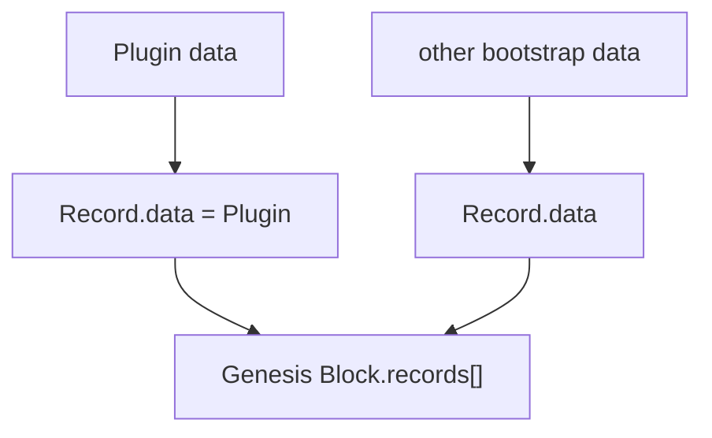

# Genesis

本文记录 Genesis 当前已经确认的迁移边界。具体 Genesis RecordId、Header、签名和链 identity 规则将在 `core.record` / `core.block` 审查时继续依据旧 Service 逐项确定。

历史事实依据见 [`source-baseline.md`](source-baseline.md)。

## Source Fact

旧 `blockchain-service` 的 Genesis 是一个实际 `Block`：

```text
Block
├── Header
└── Records[]
```

脚本先把每个系统 `Protocol` 构造成：

```text
Record
└── data = Protocol
```

再把 Root Member、Genesis Repository 等其他事实也构造成 Records，最后统一计算 Record IDs / Merkle root 并写入 Genesis Block。

因此旧实现不存在独立于 Record/Block 的 `GenesisManifest + S0 Plugin artifact set` 数据通路。

## Current migration

当前迁移保留这个结构原则：



`Protocol -> Plugin` 的变化由 `core.plugin` 定义；Genesis 仍通过通用 Record/Block 容器承载这些数据。

初始 Core Plugin 包括：

```text
core.plugin
core.record
core.entity
core.block
```

`BlockHeader` 是 `core.block` 的公开类型，不存在独立 `core.block-header` Plugin。

## Plugin artifact availability

Genesis 中的 Plugin Record 仍然必须对应可验证的 executable Plugin artifact，否则节点无法运行这些 Plugin。

但 artifact 的 transport/package 形式不是 Genesis 的第二种链上数据结构。runner 可以通过配置、随发行包携带、object storage 或其他方式取得 artifact，然后使用 `core.plugin.verifyArtifact()` 对 Record.data 中的 Plugin 与实际 bytes 做 exact verification。

具体“Genesis package 如何随节点发行”属于 Runtime/distribution，而不是 Core data model。

## Bootstrap 特例

旧代码中存在若干 Genesis-specific 行为，例如：

```text
Protocol Record.id 直接使用 ProtocolHash
bootstrap Protocol Records createdBy = "Root"
部分 bootstrap Records 没有普通 Record signature
previousHash = "0"
Root Member / Genesis Repository 在 Genesis 中创建
Genesis Repository 作为 packer
Genesis Header 使用当时的特殊签名流程
```

这些都是需要在后续 `core.record` / `core.block` / Genesis review 中逐项判断的 Source Facts。

本轮只撤销此前凭空加入的假设：

```text
Genesis != 独立 initial Plugin state S0 package
Genesis Plugin != issuer-less special Plugin release entry
```

## Current boundary

已经确认：

```text
Plugin is Record.data
Genesis is Block
Genesis contains Records
```

尚未在本轮重新冻结：

```text
Genesis BlockId / GenesisId 的最终算法
Genesis RecordId 特例是否继续保留
bootstrap Record signature 规则
Genesis Header 的当前字段与签名规则
Root Member / Genesis Repository 是否继续保留
Genesis artifact distribution 形式
```

这些问题应在对应 Core 类型审查时以旧代码为第一依据，而不是由 `core.plugin` 处理。
