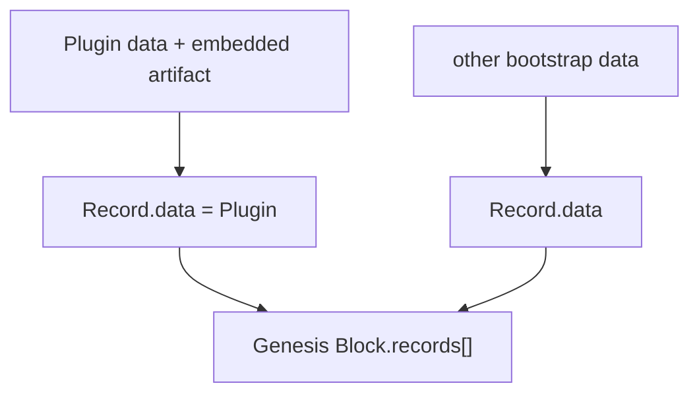

# Genesis

本文记录 Genesis 当前已经确认的迁移边界。历史事实依据见 [`source-baseline.md`](source-baseline.md)。

## Source Fact

旧 `blockchain-service` 的 Genesis 是一个实际 `Block`：

```text
Block
├── Header
└── Records[]
```

脚本先把系统 `Protocol` 构造成普通 Record data，再把 Root Member、Genesis Repository 等其他事实也构造成 Records，最后统一进入 Genesis Block。

因此旧实现不存在独立于 Record/Block 的 `GenesisManifest + S0 Plugin artifact set` 数据通路。

## Current migration

当前保留这个结构：



初始 Core Plugins：

```text
core.plugin
core.record
core.entity
core.block
```

`BlockHeader` 是 `core.block` 的公开类型，不存在独立 `core.block-header` Plugin。

## Bootstrap artifact availability

新节点必须能够取得解释 Genesis 和后续链数据所需的 Core executable content。

MVP 不要求先建立独立 Plugin registry。初始 Core Plugin Records 应携带各自完整 embedded gzip artifact：

```text
Genesis Block
└── Plugin Records
    ├── core.plugin + artifact
    ├── core.record + artifact
    ├── core.entity + artifact
    └── core.block + artifact
```

每个 embedded artifact 按当前 `core.plugin` 规则验证：

```text
canonical Base64 decode
-> exact gzip artifact bytes
-> ArtifactHash
-> PluginHash
```

然后 runner：

```text
bounded gunzip (<= 1 MiB)
-> import ESM
```

节点因此可以从 Genesis / 链数据恢复 Core runtime bytes，验证后缓存并继续运行。

`artifact` 仍只是 `Record.data = Plugin` 中的可选 storage 字段，不形成第二套 Genesis 数据结构，也不进入 PluginHash。

## Ordinary Record contract

普通 Record：

```text
RawRecord = plugin / pluginHash / createdBy / createdAt / data
Record = id / signature + RawRecord
RecordId = DoubleSHA256(JCS(RawRecord))
signature = domain-separated Ed25519 signature over RecordId
```

`core.record` 本身不包含 `if genesis` 分支。

历史 Genesis 中出现的特殊 Record 行为继续作为 bootstrap Source Facts 单独审查，而不进入 ordinary Record reusable API。

## External distribution remains optional

未来可以存在：

```text
Plugin registry
mirror / CDN
Repo/object storage
P2P artifact distribution
local cache
```

但相同 exact gzip artifact bytes 必须验证到同一个 ArtifactHash / PluginHash。对 MVP bootstrap 而言，这些渠道不是节点启动前置依赖。

## Large resources

初始 Core Plugins 应保持 executable artifact 小而自包含。大型模型、数据集、图片、地图、词典等内容应优先作为 Asset / Runtime 资源，而不是塞进 Genesis Plugin artifact。

```text
compressed artifact > ~500 KiB
-> Dev SDK/build warning only

uncompressed runtime > 1 MiB
-> ABI v1 hard reject
```

## Bootstrap Source Facts

旧代码存在若干 Genesis-specific 行为，例如：

```text
Protocol Record.id 直接使用 ProtocolHash
bootstrap Protocol Records createdBy = "Root"
部分 bootstrap Records 没有普通 Record signature
previousHash = "0"
Root Member / Genesis Repository 在 Genesis 中创建
Genesis Repository 作为 packer
Genesis Header 使用当时的特殊签名流程
```

这些事实与当前 ordinary Record contract 不一致并不意味着 `core.record` 需要兼容分支。Genesis #10 需要逐项决定哪些继续作为当前 bootstrap exception，哪些只保留为历史事实。

## Current boundary

已经确认：

```text
Plugin is Record.data
Genesis is Block
Genesis contains Records
ordinary RecordId uses JCS(RawRecord)
ordinary Record signature uses current core.record contract
PluginHash commits to ArtifactHash
embedded artifact storage does not change PluginHash
MVP Core bootstrap does not require an external Plugin registry
```

尚未冻结：

```text
Genesis BlockId / GenesisId 最终组合
历史 Protocol Record.id = ProtocolHash 特例是否继续
bootstrap createdBy = "Root" 是否继续
bootstrap Record signature 是否继续例外
Genesis Header 当前字段与签名规则
Root Member / Genesis Repository 是否继续保留
```
