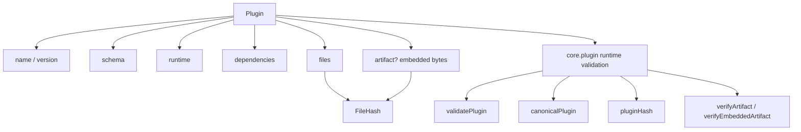
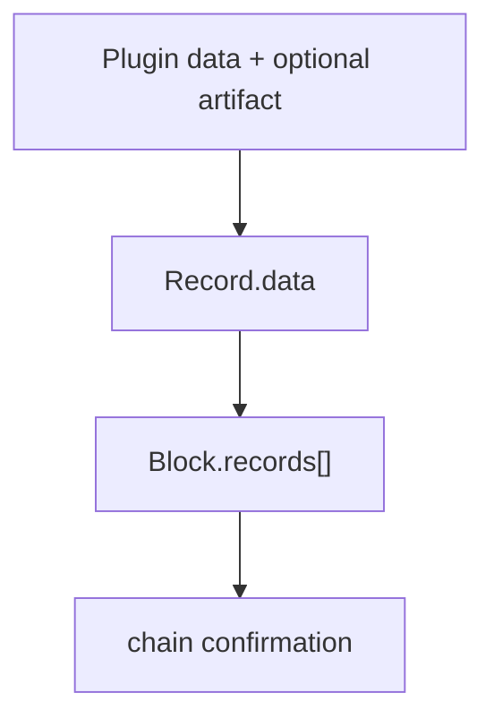

# Plugin Model

本文定义 LabourChain 当前 Plugin 数据模型、artifact 存储方式与运行时验证边界。设计迁移以旧 `blockchain-service` 的实际代码为基准；只有为了把 schema-only `Protocol` 演化为 executable Plugin 所必需的部分才在 Core 中新增。

历史事实依据见 [`source-baseline.md`](source-baseline.md)。

## 源代码基线

旧 Service 中 `Protocol` 是普通 Record 的一种 `data`：

```text
Record
├── protocol = sys.protocol:version
├── protocolHash
├── createdBy
├── createdAt
└── data = Protocol
```

Genesis 脚本同样把每个系统 `Protocol` 放入 `Record.data`，再把这些 Records 放入 Genesis Block。

当前迁移保持这个结构：

```text
Record
├── plugin = core.plugin@version
├── pluginHash = 解释该 Record 的 core.plugin identity
├── createdBy
├── createdAt
└── data = Plugin
```

`core.plugin` 不建立第二套 `PluginRelease` 数据类型，也不负责发行、权限、SDK 或网络生命周期。

## Plugin 数据

旧 `Protocol` 主要描述 schema；当前 `Plugin` 在此基础上增加 executable runtime、完整 artifact identity，以及可选的链内 artifact bytes。



第一版公共数据结构等价于：

```ts
interface Plugin {
  name: string
  version: string
  runtime: {
    kind: 'js-esm'
    abi: number
    entry: string
  }
  schema: string
  dependencies: PluginDependency[]
  files: PluginFile[]
  artifact?: PluginArtifact
}

interface PluginDependency {
  name: string
  version: string
  pluginHash: PluginHash
}

interface PluginFile {
  path: string
  size: number
  hash: FileHash
}

type PluginArtifact = Record<string, string>
```

`PluginArtifact` 的 key 是 canonical artifact path，value 是该文件 raw bytes 的 canonical RFC 4648 Base64 表示。

### 从 Protocol 到 Plugin

| 旧 Protocol | 当前 Plugin | 迁移处理 |
| --- | --- | --- |
| `protocolId` | `name` | 保留语义，改为 dotted namespace |
| `version` | `version` | 保留，明确 exact SemVer 2.0.0 |
| `schema` inline CUE | `schema` artifact path | 保留 schema 语义，改由 artifact file 承载 |
| `package` | 删除 | schema/runtime 文件自身承载相关 module/package 信息 |
| `contributors` | 删除 | 属于 Record / Repo / Labour provenance |
| `description` | 删除 | 不属于运行时有效性 |
| 无 | `runtime` | executable Plugin 必需新增 |
| 无 | `dependencies` | chain Plugin runtime dependency 必需新增 |
| 无 | `files` | executable artifact identity 必需新增 |
| 无 | `artifact?` | 允许小型 executable artifact 随 Plugin Record 上链 |

`contributors`、源码地址、build inputs、release notes 等仍可由更高层事实表达，但不进入 Plugin runtime identity。

## Name 与 version

Plugin name 使用 lowercase dotted namespace：

```regex
^[a-z][a-z0-9-]*(\.[a-z][a-z0-9-]*)+$
```

例如：

```text
core.plugin
core.record
repo.asset
work.labour
```

Plugin version 使用 exact SemVer 2.0.0：

```text
0.1.0
1.2.3-alpha.1
1.2.3+build.7
```

不接受 range、tag 或 workspace reference：

```text
^1.2.0
>=1 <2
latest
workspace:*
v1.2.0
```

`name@version` 是可读引用；精确 executable identity 始终是 `PluginHash`。

## Runtime

第一版 runtime descriptor：

```text
kind = js-esm
abi = positive safe integer
entry = canonical artifact path
```

`kind` 表示 artifact 的加载格式；`entry` 指向 artifact 内实际执行入口；`abi` 标识 LabourChain Plugin runner ABI。

ABI 不描述 Node.js 版本、Cordis server 版本、部署路径、sandbox 或进程生命周期。这些属于 runner/runtime。

## Schema

旧 Protocol 直接把 canonicalized CUE schema 文本放入数据并参与 ProtocolHash。

当前 `schema` 是 artifact 内的 canonical path，例如：

```text
schema.cue
```

schema raw bytes 由对应 `files[]` 的 `FileHash` 承诺。因此当前 identity 与旧 ProtocolHash 有一个明确变化：schema 的空格、注释或换行只要改变 raw bytes，就会改变 FileHash 与 PluginHash。

这是从 schema descriptor 迁移到 exact executable artifact identity 的显式设计变化。

## Dependencies

`dependencies[]` 只描述运行时仍然作为独立链 Plugin 存在的依赖：

```text
name
version
pluginHash
```

`pluginHash` 是权威 identity；`name/version` 用于可读性与一致性检查。

普通 npm/pnpm/build dependency 不属于这里。一个 Plugin artifact 在运行时应当自包含，除非依赖已经在 `dependencies[]` 中以 exact PluginHash 声明。

同一个 Plugin 中 dependency name 必须唯一。

`dependencies[]` 的输入顺序没有语义。canonicalization 时由 `core.plugin` 按 dependency `name` 的 UTF-8 lexicographical ascending order 自动排序。

## Files

`files[]` 描述参与 Plugin runtime/schema identity 的完整 executable artifact 文件集合：

```text
path
size
hash
```

其中：

```text
FileHash = DoubleSHA256(raw file bytes)
```

- `path` 是 UTF-8、case-sensitive、relative POSIX path；
- `size` 是 non-negative safe integer，`-0` 非法；
- `hash` 是 64-character lowercase hexadecimal FileHash。

拒绝 absolute path、空 path、`.` / `..` segment、反斜杠、NUL、lone surrogate / invalid Unicode。

file path 必须唯一。`files[]` 的输入顺序没有语义；canonicalization 时按 canonical path 的 UTF-8 lexicographical ascending order 自动排序。

archive 本身不是 `files[]` 项，避免自引用 hash。tar/zip/gzip、mtime、uid/gid、filesystem mode、compression metadata 都不属于 Plugin identity。

## Embedded artifact

`artifact?` 允许 Plugin Record 直接携带 executable artifact bytes：

```json
{
  "artifact": {
    "runtime.mjs": "ZXhwb3J0IGNvbnN0IGFuc3dlciA9IDQyCg==",
    "schema.cue": "cGFja2FnZSBjb3JlX3BsdWdpbgo="
  }
}
```

规则：

- key 必须是 `files[]` 中已声明的 canonical path；
- value 必须是 canonical RFC 4648 Base64；
- `artifact` 一旦存在，必须完整覆盖 `files[]`，不得缺失或增加文件；
- Base64 解码后的 raw bytes 必须匹配对应 `size` 与 `FileHash`；
- `runtime.entry` 与 `schema` 仍然必须属于该完整 artifact。

因此一个同步到 Plugin Record 的节点可以直接从链数据恢复 executable bytes、验证并缓存，而不必先访问独立 Plugin registry。

`artifact` 是内容的链内承载方式，不是新的 Plugin identity。相同 `files[]` 对应的 exact bytes，无论随 Record 内嵌、由本地 cache 提供，还是从外部镜像取得，都代表同一个 executable Plugin。

## PluginHash 与 artifact storage 分离

对象字段顺序不属于 identity。第一版 canonical identity bytes 使用 RFC 8785 JSON Canonicalization Scheme（JCS）。

```text
Plugin input
  -> validate shape / values / uniqueness
  -> validate optional embedded artifact
  -> remove artifact storage field from identity form
  -> sort dependencies[] by name
  -> sort files[] by path
  -> RFC 8785 JCS
  -> UTF-8 bytes
```

```text
PluginHash = DoubleSHA256(canonical Plugin identity bytes)
```

PluginHash 直接承诺：

```text
name / version
runtime descriptor
schema path
exact Plugin dependencies
file paths
file sizes
FileHash values
```

而每个 FileHash 又承诺 raw file bytes，因此 PluginHash 已经 transitively commits to exact executable artifact content。

`artifact` 是否内嵌不改变 PluginHash。错误的 embedded bytes 会因为 size/FileHash 不匹配而被拒绝，而不会形成第二种 identity。

## Artifact 与 Asset

Plugin artifact 是运行 Plugin 本身所需的程序内容：

```text
runtime code
schema
wasm/native payload when supported
必要的小型 runtime data
```

大型静态内容通常不应塞进 executable artifact，例如：

```text
图片 / 视频
大型模型
大型地图或词典
数据集
游戏资源包
大型参考文档
```

这些内容可以由更高层 Asset 能力表达和存储，再由 Plugin 在运行时通过显式输入或领域协议取得。

`core.plugin` 不依赖 Asset，也不理解 AssetId。关系是单向组合：上层 Asset/Runtime 可以为 Plugin 提供大型内容，Core Plugin identity 仍只处理自身 executable artifact。

## Bundle size 规则

小型、必要的 Plugin 默认适合把完整 artifact 随 Record 上链。Core bootstrap Plugin 尤其应保持小而自包含。

构建工具应像 Vite 一样报告 artifact bundle size，并在总 raw bytes 大约超过 **500 KiB** 时给出 warning，例如：

```text
Plugin artifact: 612.4 KiB
warning: large executable artifact; consider moving static resources to Assets
```

500 KiB 是开发工具建议阈值，不是 Core validity rule：

```text
499 KiB -> valid
800 KiB -> valid, tooling warning
```

网络、Block 或 `core.plugin` validator 不得仅因为 artifact 大于该阈值而拒绝它。

## Runtime verification

`core.plugin` 围绕 Plugin 数据提供确定性能力：

```text
validatePlugin(plugin)
canonicalPlugin(plugin)
fileHash(bytes)
pluginHash(plugin)
verifyArtifact(plugin, files, expectedPluginHash?)
verifyEmbeddedArtifact(plugin, expectedPluginHash?)
```

`validatePlugin()` 会验证 optional embedded artifact 的 canonical Base64、完整 file set、size 与 FileHash。

`verifyArtifact()` 用于 caller 显式提供 artifact bytes 的情况，例如本地 cache、Repo storage、HTTP mirror 或其他 resolver。

`verifyEmbeddedArtifact()` 使用 Plugin 自身 `artifact` 字段恢复 bytes 并执行同一 exact verification。

`core.plugin` 不负责下载、缓存、持久化、package-manager resolution 或 Asset fetch。

## Record 与 Block 边界

Plugin 作为通用 Record 数据进入链：



以下问题不属于 `core.plugin`：

```text
谁可以创建 Plugin Record
Repository / Member 业务身份
Plugin Record 何时可以被其他 Record 引用
版本推荐 / deprecated / abandoned
packer 或 network policy
Core distribution / profile
external artifact fetch/cache/storage
Asset storage / provenance
source/build provenance
SDK / CLI / package publishing
```

## Genesis 与无 registry 启动

Genesis 继续是一个 Block，初始 Plugin 继续通过 `Record.data = Plugin` 进入 `Block.records[]`。

MVP 中，为了让新节点只依赖 Genesis/链数据即可获得解释链所需的代码，初始 Core Plugins：

```text
core.plugin
core.record
core.entity
core.block
```

应在各自 Plugin Record 中携带完整 embedded artifact。

这样节点可以：

```text
读取 Genesis Plugin Record
-> 解码 embedded artifact
-> 校验 FileHash / PluginHash
-> cache/load
-> 继续解释和同步链
```

不需要在项目初期先建立 npm-style Plugin registry。未来 registry、mirror、CDN 或 P2P 可以作为分发加速与冗余，但不是 Core bootstrap 的前置条件。

Genesis 的 RecordId、签名、Header 等 bootstrap 特例仍需在 `core.record` / `core.block` / Genesis 独立审查中决定；`core.plugin` 不定义这些特例。
