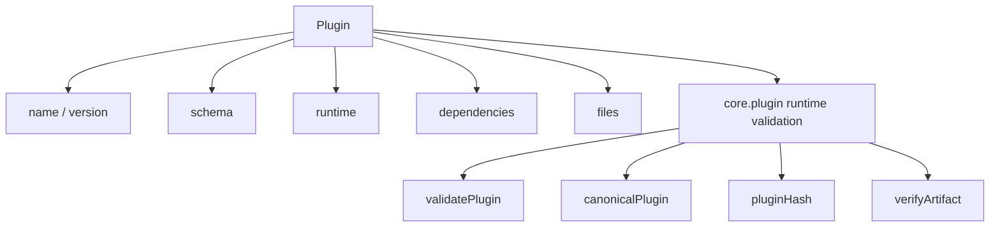
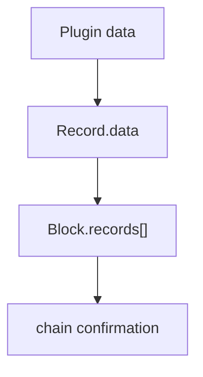

# Plugin Model

本文定义 LabourChain 当前 Plugin 数据模型与运行时验证边界。设计迁移以旧 `blockchain-service` 的实际代码为基准；只有为了把 schema-only `Protocol` 演化为 executable Plugin 所必需的部分才在 Core 中新增。

历史事实依据见 [`source-baseline.md`](source-baseline.md)。

## 源代码基线

旧 Service 中 `Protocol` 是普通 Record 的一种 `data`：

```text
Record
├── protocol = sys.protocol:version
├── protocolHash
├── createdBy
├── createdAt
└── data = Protocol
```

Genesis 脚本同样把每个系统 `Protocol` 放入 `Record.data`，再把这些 Records 放入 Genesis Block。

当前迁移保持这个结构：

```text
Record
├── plugin = core.plugin@version
├── pluginHash = 解释该 Record 的 core.plugin identity
├── createdBy
├── createdAt
└── data = Plugin
```

`core.plugin` 不建立第二套 `PluginRelease` 数据类型，也不负责发行、权限、SDK 或网络生命周期。

## Plugin 数据

旧 `Protocol` 主要描述 schema；当前 `Plugin` 在此基础上增加可执行 runtime 与完整 artifact identity。



第一版公共数据结构等价于：

```ts
interface Plugin {
  name: string
  version: string
  runtime: {
    kind: 'js-esm'
    abi: number
    entry: string
  }
  schema: string
  dependencies: PluginDependency[]
  files: PluginFile[]
}

interface PluginDependency {
  name: string
  version: string
  pluginHash: PluginHash
}

interface PluginFile {
  path: string
  size: number
  hash: FileHash
}
```

### 从 Protocol 到 Plugin

| 旧 Protocol | 当前 Plugin | 迁移处理 |
| --- | --- | --- |
| `protocolId` | `name` | 保留语义，改为 dotted namespace |
| `version` | `version` | 保留，明确 exact SemVer 2.0.0 |
| `schema` inline CUE | `schema` artifact path | 保留 schema 语义，改由 artifact file 承载 |
| `package` | 删除 | schema/runtime 文件自身承载相关 module/package 信息 |
| `contributors` | 删除 | 属于 Record / Repo / Labour provenance |
| `description` | 删除 | 不属于运行时有效性 |
| 无 | `runtime` | executable Plugin 必需新增 |
| 无 | `dependencies` | chain Plugin runtime dependency 必需新增 |
| 无 | `files` | executable artifact identity 必需新增 |

`contributors`、源码地址、build inputs、release notes 等仍可由更高层事实表达，但不进入 Plugin runtime identity。

## Name 与 version

Plugin name 使用 lowercase dotted namespace：

```regex
^[a-z][a-z0-9-]*(\.[a-z][a-z0-9-]*)+$
```

例如：

```text
core.plugin
core.record
repo.asset
work.labour
```

Plugin version 使用 exact SemVer 2.0.0：

```text
0.1.0
1.2.3-alpha.1
1.2.3+build.7
```

不接受 range、tag 或 workspace reference：

```text
^1.2.0
>=1 <2
latest
workspace:*
v1.2.0
```

`name@version` 是可读引用；精确 executable identity 始终是 `PluginHash`。

## Runtime

第一版 runtime descriptor：

```text
kind = js-esm
abi = positive safe integer
entry = canonical artifact path
```

`kind` 表示 artifact 的加载格式；`entry` 指向 artifact 内实际执行入口；`abi` 标识 LabourChain Plugin runner ABI。

ABI 不描述 Node.js 版本、Cordis server 版本、部署路径、sandbox 或进程生命周期。这些属于 runner/runtime。

## Schema

旧 Protocol 直接把 canonicalized CUE schema 文本放入数据并参与 ProtocolHash。

当前 `schema` 是 artifact 内的 canonical path，例如：

```text
schema.cue
```

schema raw bytes 由对应 `files[]` 的 `FileHash` 承诺。因此当前 identity 与旧 ProtocolHash 有一个明确变化：schema 的空格、注释或换行只要改变 raw bytes，就会改变 FileHash 与 PluginHash。

这是从 schema descriptor 迁移到 exact executable artifact identity 的显式设计变化。

## Dependencies

`dependencies[]` 只描述运行时仍然作为独立链 Plugin 存在的依赖：

```text
name
version
pluginHash
```

`pluginHash` 是权威 identity；`name/version` 用于可读性与一致性检查。

普通 npm/pnpm/build dependency 不属于这里。一个 Plugin artifact 在运行时应当自包含，除非依赖已经在 `dependencies[]` 中以 exact PluginHash 声明。

同一个 Plugin 中 dependency name 必须唯一。

`dependencies[]` 的输入顺序没有语义。canonicalization 时由 `core.plugin` 按 dependency `name` 的 UTF-8 lexicographical ascending order 自动排序。

## Files

`files[]` 描述参与 Plugin runtime/schema identity 的完整逻辑文件集合：

```text
path
size
hash
```

其中：

```text
FileHash = DoubleSHA256(raw file bytes)
```

- `path` 是 UTF-8、case-sensitive、relative POSIX path；
- `size` 是 non-negative safe integer，`-0` 非法；
- `hash` 是 64-character lowercase hexadecimal FileHash。

拒绝 absolute path、空 path、`.` / `..` segment、反斜杠、NUL、lone surrogate / invalid Unicode。

file path 必须唯一。`files[]` 的输入顺序同样没有语义；canonicalization 时按 canonical path 的 UTF-8 lexicographical ascending order自动排序。

manifest/archive 本身不是 `files[]` 项，避免自引用 hash。tar/zip/gzip、mtime、uid/gid、filesystem mode、compression metadata 都不属于 Plugin identity。

## Canonical Plugin 与 PluginHash

对象字段顺序不属于 identity。第一版 canonical bytes 使用 RFC 8785 JSON Canonicalization Scheme（JCS）。

```text
Plugin input
  -> validate shape / values / uniqueness
  -> sort dependencies[] by name
  -> sort files[] by path
  -> RFC 8785 JCS
  -> UTF-8 bytes
```

JCS 递归 canonicalize object properties，不重新排序 array；因此两个 set-like arrays 的排序由 Plugin 规则在 JCS 前完成。

```text
PluginHash = DoubleSHA256(canonical Plugin bytes)
```

serialized form 为 64-character lowercase hexadecimal。

PluginHash 直接承诺：

```text
name / version
runtime descriptor
schema path
exact Plugin dependencies
file paths
file sizes
FileHash values
```

而每个 FileHash 又承诺 raw file bytes，因此 PluginHash transitively commits to exact executable artifact content。

## Runtime verification

`core.plugin` 第一版只需要围绕 Plugin 数据提供确定性运行时能力：

```text
validatePlugin(plugin)
canonicalPlugin(plugin)
fileHash(bytes)
pluginHash(plugin)
verifyArtifact(plugin, files, expectedPluginHash?)
```

`verifyArtifact()` 至少检查：

1. Plugin shape、name、version、runtime、schema、dependency/file descriptors；
2. dependency name 与 file path uniqueness；
3. canonical paths、Unicode 与 safe integer 约束；
4. `runtime.entry` 与 `schema` 均存在于 `files[]`；
5. caller 提供的实际 file set 与声明完全相同；
6. 每个 file 的 byte length 与 FileHash；
7. canonical Plugin bytes 与 derived PluginHash；
8. 如果 caller 给出 `expectedPluginHash`，要求完全一致。

`core.plugin` 不负责下载、缓存、持久化 artifact，也不负责 package-manager resolution。caller/runner 提供待验证的 Plugin 数据与实际 file bytes。

## Record 与 Block 边界

Plugin 如何成为链上事实由通用 Record/Block 结构表达：



`core.plugin` 到验证 Plugin 数据与 artifact identity 为止。

以下问题不属于 `core.plugin`：

```text
谁可以创建 Plugin Record
Repository / Member 业务身份
Plugin Record 何时可以被其他 Record 引用
版本推荐 / deprecated / abandoned
packer 或 network policy
Core distribution / profile
artifact fetch/cache/storage
source/build provenance
SDK / CLI / package publishing
```

这些问题应在对应的 Record/Block ordering、network/runtime 或业务 package 中分别定义，而不是让 `core.plugin` 形成第二套状态机。

## Genesis 边界

旧 Service 已经证明 Genesis 仍然是一个 Block，系统 Protocol 也是其中的 Records。

当前迁移继续采用同一结构原则：初始 Plugin 通过 `Record.data = Plugin` 出现在 Genesis Block 中，而不是另建 `S0 Plugin artifact set` 或 issuer-less Plugin release channel。

Genesis 中 RecordId、签名、Header 等具体 bootstrap 特例仍需在 `core.record` / `core.block` / Genesis 的独立审查中根据源代码逐项决定；`core.plugin` 不定义这些特例。
